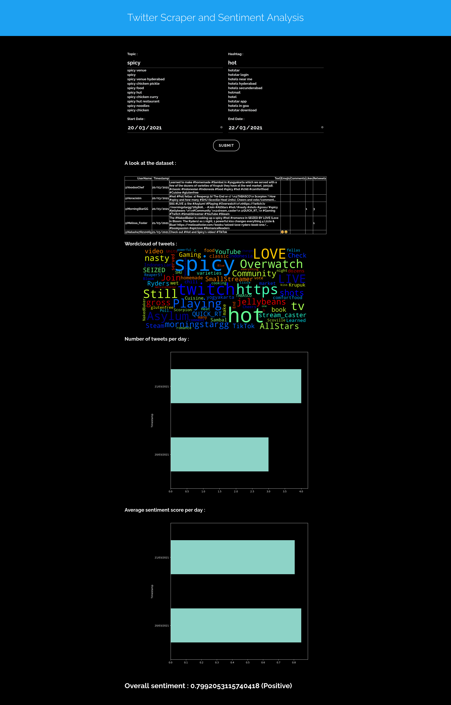

# A Flask application to scrape and analyse sentiment of a given topic and hashtag
## NOTE: to run this program you will need to download the latest [Chromedriver](https://chromedriver.chromium.org/) and paste it in the directory. 

To start the web app, run:
```bash
flask run
```
and follow the link to http://127.0.0.1:5000/ to open the web page.

## An example of the output:


